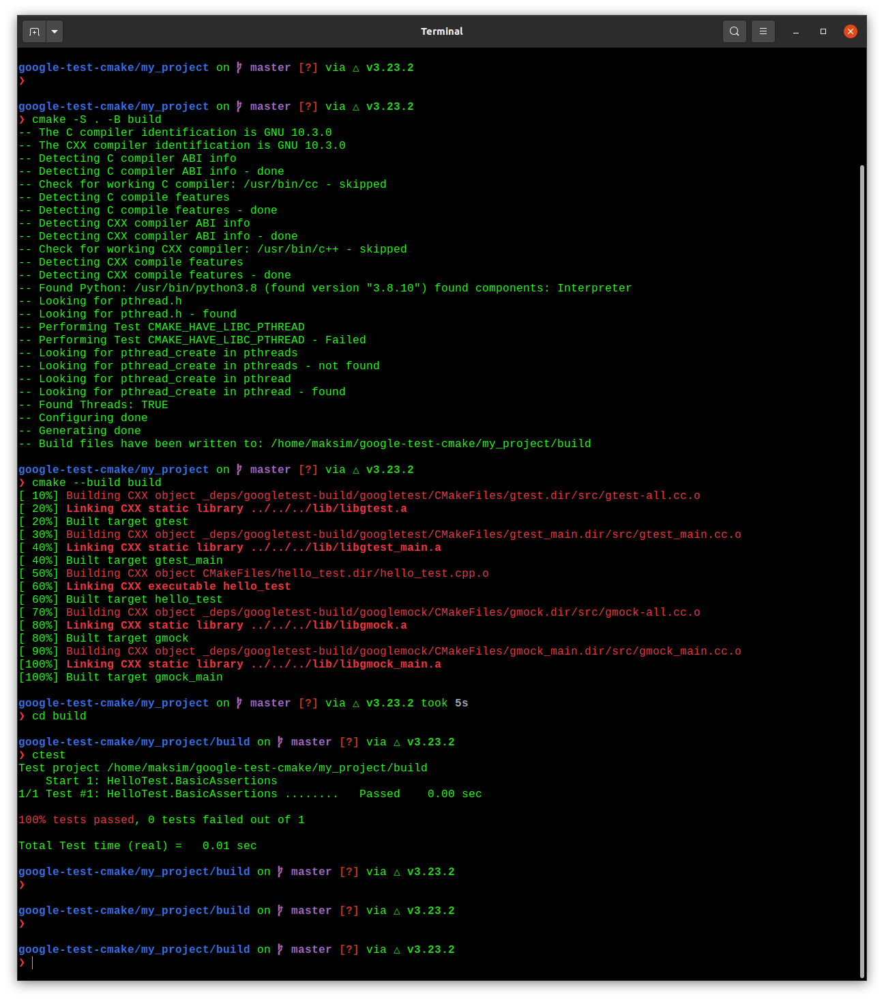

## Google Test: CMake

- [Google Test: CMake](#google-test-cmake)
  - [Quickstart: Building with CMake](#quickstart-building-with-cmake)
  - [CMake Tools](#cmake-tools)
  - [GoogleTest Samples](#googletest-samples)
  - [gMock for Dummies](#gmock-for-dummies)

### Quickstart: Building with CMake

**Set up a project**

CMake uses a file name `CMakeLists.txt` to configure the build system for a project. You'll use this file to set up your project and declare a dependency on GoogleTest.

First create a directory for your project.

```
mkdir my_project
cd my_project
```

Next, you'll create the `CMakeLists.txt` file and declare a dependency on GoogleTest. There are many ways to express dependencies in the CMake ecosystem; here, we'll use the `FetchContent` Cmake module. To do this, in your project directory, create a file named `CMakeLists.txt` with the following contents:

```cmake
cmake_minimum_required(VERSION 3.14)
project(my_project)

# GoogleTest requires at least C++11
set(CMAKE_CXX_STANDARD 11)

include(FetchContent)
FetchContent_Declare(
    googletest
    url https://github.com/google/googletest/archive/609281088cfefc76f9d0ce82e1ff6c30cc3591e5.zip
)
```

For more information about how to create `CMakeLists.txt` files, see the [CMake tutorial](https://cmake.org/cmake/help/latest/guide/tutorial/index.html)

**Create and run a binary**

With GoogleTest declared as a dependency, you can use GoogleTest code within your project.

As an example, create a file named `hello_test.cpp` in your project directory with the following contents:

```cpp
#include <gtest/gtest.h>

// Demonstrate some basic assertions.
TEST(HelloTest, BasicAssertions) {
  // Expect two strings not to be equal.
  EXPECT_STRNE("hello", "world");
  // Expect equality.
  EXPECT_EQ(7 * 6, 42);
}
```

GoogleTest provides assertions that you can use to test the behaviour of your code. The above example includes the main GoogleTest header file and demonstrates some basic [assertions](https://google.github.io/googletest/reference/assertions.html). 

To build the code, add the following to the end of your `CMakeLists.txt` file:

```cmake
enable_testing()

add_executable(
  hello_test
  hello_test.cc
)
target_link_libraries(
  hello_test
  gtest_main
)

include(GoogleTest)
gtest_discover_tests(hello_test)
```

The above configuration enables testing in CMake, declares the C++ test binary you want to build (`hello_test`), and links to GoogleTest (`gtest_main`). The last two lines enable CMake's test runner to discover the tests included in the binary, using the GoogleTest CMake module.

Now you can build and run your test:

```
cmake -S . -B build
cmake --build build
cd build
ctest
```



### CMake Tools

[source](https://code.visualstudio.com/docs/cpp/CMake-linux)

The CMake Tools extension integrates VSCode and CMake to make it easy to configure, build, and debug your C++ project.

**Ensure the CMake is installed**

```
cmake --version
```

**Ensure that development tools are installed**

```
gcc -v
sudo apt-get install build-essential gdb
```

**Create a CMake project**

```
mkdir cmakeQuickStart
cd cmakeQuickStart
code .
```

The `code .` command opens VSCode in the current directory, which becomes your "workspace".

Open the command palette and run the `CMake: Quick Start` command.

Enter a project name, this will be written to `CMakeLists.txt` and a few initial source files. 

Next, select `Executable` as the project type to create a basic source file (`main.cpp`) that includes a basic `main()` function.

Note: if you had wanted to create a basic source and header file, you would have selected `Library` instead.

**Build**

Open the command palette and run the `Cmake: Build` command, or select the `Build` button from the status bar.

**Debug**

Put a breakpoint on a line, then open the command palette and run `Cmake: Debug`.

**Run tests**

Open the command palette and run the `CMake: Run Tests` command. 

Manually (after builing):

```
cd build
ctest
```

[Additional information](https://github.com/microsoft/vscode-cmake-tools/blob/main/docs/README.md)

### GoogleTest Samples

[source](https://google.github.io/googletest/samples.html)

- [sample-1](my_samples/sample-1/sample-1.md): shows the basic steps of using googletest to test C++ functions
- [sample-2](my_samples/sample-2/sample-2.md): shows a more complex unit test for a class with multiple member functions
- [sample-3](my_samples/sample-3/sample-3.md): uses a test fixture 
- [sample-4](my_samples/sample-4/sample-4.md): teaches you how to use googletest and `googletest.h` together to get the best of both libraries
- [sample-5](my_samples/sample-5/sample-5.md): puts shared testing logic in a base test fixture, and reuses it in derived fixtures
- [sample-6](my_samples/sample-6/sample-6.md): demonstrates type-parametrized tests
- [sample-7](my_samples/sample-7/sample-7.md): teaches the basics of value-parametrized tests
- [sample-8](my_samples/sample-8/sample-8.md): shows using `Combine()` in value-parametrized tests
- [sample-9](my_samples/sample-9/sample-9.md): shows use of listener API to modify Google Test's console output and the use of its reflection API to inspect test results
- [sample-10](my_samples/sample-10/sample-10.md): shows use of the listener API to implement a primitive memory leak checker

### gMock for Dummies

[source](https://google.github.io/googletest/gmock_for_dummies.html)

When you write a prototype or test, often it's not feasible to rely on real objects entirely. A mock object implements the same interface as a real object (so it can be used once), but lets you specify at run time how it will be used and what is should do (which methods will be called? In what order? How many times? With what arguments?...)

It is easy to confuse the term _fake objects_ with mock objects. Fakes and mocks actually mean different things in the Test-Driven Development (TDD) community:

- Fake objects have working implementations, but usually take some shortcut (perhaps to make the operations less expensive), which makes them not suitable for production. An in-memory file system would be an example of a fake.
- Mocks are objects pre-programmed with _expectations_, which form a specification of the calls they are expected to receive.

The most important thing to remember is that a mock allows you to check the _interaction_ between itself and code that uses it.

`gMock` is a library for creating mock classes and using them. 

When using gMock,

1. First, you use some simple macros to describe the interface you want to mock, and they will expand to the implementation of your mock class;
2. Next, you create some mock objects and specify its expectations and behaviour using an intuitive syntax. 
3. Then you exercise code that uses the mock objects. gMock will catch any violation to the expectations as soon as it arises.

**Why gMock?**

While mock objects help you remove unnecessary dependencies in tests and make them fast and reliable, using mocks manually in C++ is _hard_:

- Someone has to implement the mocks. The job is usually tedious and error-prone.
- The quality of those manually written mocks is a bit unpredictable.
- The knowledge you gained from using one mock doesn't transfer to the next one

gMock was built to help C++ programmers. It is your friend if any of the following problems is bothering you:

- You are stuck with a sub-optimal design and wish you had done more prototyping before it was too late.
- Your tests are slow as they depend on too many libraries or use expensive resources (e.g. a database)
- Your tests are brittle as some resources they use are unreliable (e.g. the network)
- You want to test how your code handles a failure (e.g. a file checksum error), but it't not easy to cause one
- You need to make sure that your module interacts with other modules in the right way, but it's hard to observe the interaction; therefore you resort to observing the side effects at the end of the action, but it's awkward at best.
- You want to "mock" your dependencies, except they don't have mock implementations yet.

We encourage you to use gMock as

- a _design_ tool, for it lets you experiment with your interface design early and often. More iterations lead to better desing.
- a _testing_ tool to cut your tests' outbound dependencies and probe the interaction between your module and its collaborators.

**Getting Started**

Suppose you are developing a graphics program that relies on a LOGO-line API for drawing. How would you test that it does the right thing? Fortunately, you learned about Dependency Injection and know the right thing to do: instead of having your application talk to the system API directly, wrap the API in an interface and code to that interface:

```cpp
class Turtle {
  ...
  virtual ~Turtle() {}
  virtual void PenUp() = 0;
  virtual void PenDown() = 0;
  virtual void Forward(int distance) = 0;
  virtual void Turn(int degrees) = 0;
  virtual void GoTo(int x, int y) = 0;
  virtual int GetX() const = 0;
  virtual int GetY() const = 0;
}
```

Note that the destructor of `Turtle` must be virtual, as is the case for all classes you intend to inherit from — otherwise the destructor of the derived class will not be called when you delete an object through a base pointer, and you'll get corrupted program states like memory leaks.

Your program will normally use a real implementation of this interface. In tests, you can use a mock implementation instead. This allows you to easily check what drawing primitives your program is calling, with what arguments, and in which order. Tests written this way are much more robust (they won't break because your new machine does anti-aliasing differently), easier to read and maintain and run much faster.

**Writing the Mock Class**

How to define it:

Using the `Turtle` interface as example, here are the simple steps you need to follow:

1. Derive a class `MockTurtle` from `Turtle`
2. Take a _virtual_ function of `Turtle` (while it's possible to mock non-virtual methods using templates, it's much more involved).
3. In the `public`: section of the child class, write `MOCK_METHOD();`
4. Now take the function signature, cut-and-paste it into the macro, and add two commas — one between the return type and the name, another between the name and the argument list.
5. If you're mocking a `const` method, add a 4th parameter containing `(const)` 
6. Since you're overriding a virtual method, we suggest adding the `override` keyword. For const methods the 4th parameter becomes `(const, override)`, for non-const methods just `(override)`.
7. Repeat until all virtual functions you want to mock are done. (It goes without saying that _all_ pure virtual methods in your abstract clas must be either mocked or overridden).

```cpp
class MockTurtle : public Turtle {
  public:
    ...
    MOCK_METHOD(void, PenUp, (), (override));
    MOCK_METHOD(void, PenDown, (), (override));
    MOCK_METHOD(void, Forward, (int distance), (override));
    MOCK_METHOD(void, Turn, (int degrees), (override));
    MOCK_METHOD(void, GoTo, (int x, int y), (override));
    MOCK_METHOD(int, GetX, (), (const, override));
    MOCK_METHOD(int, GetY, (), (const, override));
}
```

**Where to Put it**

When you define a mock class, you need to decide where to put its definition. Some people put it in a `_test.cc`. This is fine when the interface being mocked (say, `Foo`) is owned by the same person or team. Otherwise, when the owner of `Foo` changes it, your test could break. 

**Using Mocks in Tests**

Once you have a mock class, using it is easy. The typical work flow is:

1. Import the gMock names from the `testing` namespace such that you can use them unqualified. Remember that namespaces are a good idea.
2. Create some mock objects.
3. Specify your expectations on them (How many times will a method be called? With what arguments? What should it do?)
4. Exercise some code that uses the mocks; optionally, check the result using googletest assertions. If a mock method is called more than expected or with wrong arguments, you'll get an error immediately.
5. When a mock is destructured, gMock will autotically check whether all expectations on it have been satisfied.

```cpp
#include "path/to/mock-turtle.h"
#include "gmock/gmock.h"
#include "gtest/gtest.h"

using ::testing::AtLeast; 

TEST(PainterTest, CanDrawSomething) {
  MockTurtle turtle;
  EXPECT_CALL(turtle, PenDown())
    .Times(AtLeast(1));

  Painter painter(&turtle);

  EXPECT_TRUE(painter.DrawCircle(0, 0, 10));
}
```

This test checks that `PenDown()` is called at least once. If the `painter` object didn't call this method, your test will fail with a message like this:

```
path/to/my_test.cc:119: Failure
Actual function call count doesn't match this expectation:
Actually: never called;
Expected: called at least once.
Stack trace:
...
```

If you mock objects are never deleted, the final verification won't happen. Therefore it's a good idea to turn on the heap checker in your tests when you allocate mocks on the heap. You get that automatically if you use the `gtest_main` library already.

gMock requires expectations to be set before the mock functions are called, otherwise the behaviour is undefined. Do not alternate between calls to `EXPECT_CALL()` and calls to mock functions, and do not set any expectations on a mock after passing the mock to an API.

This means `EXPECT_CALL()` should be read as expecting that a call will occur _in the future_, not that a call has occured, 

**Setting Expectations**

The key to using a mock object successfully is to set the _right expectations_ on it. If you set the expectations too strict, your test will fail as the result of unrelated changes. If you set them too loose, bugs can slip through. 

General syntax

In GMock we use the `EXPECT_CALL()` macro to set an expectation on mock method. The general syntax is:

```
EXPECT_CALL(mock_object, method(matchers))
    .Times(cardinality)
    .WillOnce(action)
    .WillRepeatedly(action);
```

Actions: what should it do?

