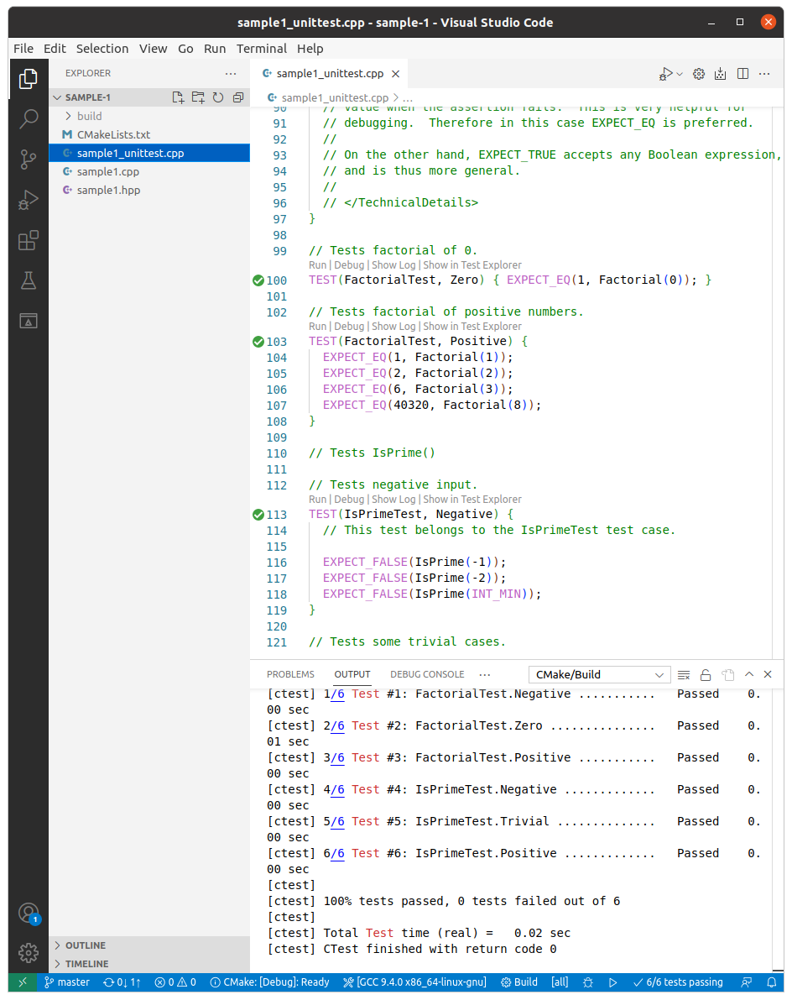

## sample 1

> Shows the basic steps of using googletest to test C++ functions

```
cd ~/google-test-samples/gtest/sample-1
code .
```

Command palette -> `Cmake: Build` (delete previous `build` folder if present)

Run tests: Cmake: `Cmake: Run tests`

Result:



Let's take a closer look:

`CMakeLists.txt`:

```cmake
cmake_minimum_required(VERSION 3.14)
project(sample1)

# GoogleTest requires at least C++11
set(CMAKE_CXX_STANDARD 11)

include(FetchContent)
FetchContent_Declare(
  googletest
  URL https://github.com/google/googletest/archive/609281088cfefc76f9d0ce82e1ff6c30cc3591e5.zip
)
# For Windows: Prevent overriding the parent project's compiler/linker settings
# set(gtest_force_shared_crt ON CACHE BOOL "" FORCE)

FetchContent_MakeAvailable(googletest)

enable_testing()

add_executable(
    sample1_unittest
    sample1_unittest.cpp
    sample1
    sample1.cpp
)

target_link_libraries(
    sample1_unittest
    gtest_main
)

include(GoogleTest)
gtest_discover_tests(sample1_unittest)
```

The most important to remark here are the `add_executable()` and `target_link_libraries()` commands, as these might change from project to project.

In `add_executable()` you'll need to add all the source files (`*.cpp`), as well as its binary (e.g. `sample1`)

`sample1_unittest.cpp`:

The comments should be pretty self-explanatory. For testing we're using the following macros:

- `TEST()`: TEST has two parameters: the test case name and the test name. After using the macro, you should define your test logic between a pair of braces.
- `EXPECT_EQ()`: expect to be equal
- `EXPECT_GT()`: expect greater than
- `EXPECT_TRUE()`
- `EXPECT_FALSE()`

Similar to `EXPECT` macros, there's also `ASSERT` macros, these should be used whenever an error would make is meaningless to continue the testing block (if `EXPECT` gives an error the test run is not aborted).
