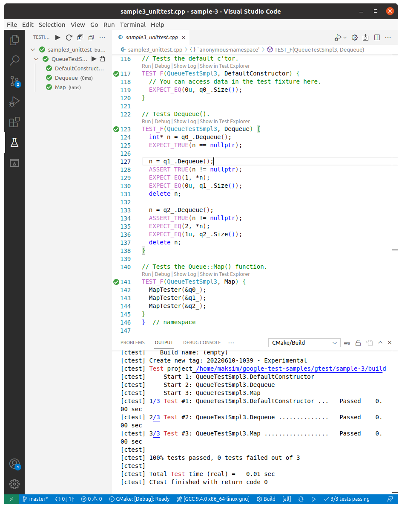

## sample 3

> Uses a test fixture

A test fixture is a place to hold objects and functions shared by all tests in a test case. Using a test fixture avoid duplicating the test code necessary to initialize and cleanup those common objects for each test. It is also useful for definining sub-routines that your tests need a lot.

The tests share the test fixture in the sense of code sharing, not data sharing. Each test is given its own fresh copy of the fixture. You cannot expect the data modified by one test to be passed on to another test.

To use test fixture, derive a class from testing::Test:

```cpp
class QueueTestSmpl3 : public testing::Test {
 protected:  // You should make the members protected s.t. they can be
             // accessed from sub-classes.
  // virtual void SetUp() will be called before each test is run.  You
  // should define it if you need to initialize the variables.
  // Otherwise, this can be skipped.
  void SetUp() override {
    q1_.Enqueue(1);
    q2_.Enqueue(2);
    q2_.Enqueue(3);
  }

  // virtual void TearDown() will be called after each test is run.
  // You should define it if there is cleanup work to do.  Otherwise,
  // you don't have to provide it.
  //
  // virtual void TearDown() {
  // }

  // A helper function that some test uses.
  static int Double(int n) { return 2 * n; }

  // A helper function for testing Queue::Map().
  void MapTester(const Queue<int>* q) {
    // Creates a new queue, where each element is twice as big as the
    // corresponding one in q.
    const Queue<int>* const new_q = q->Map(Double);

    // Verifies that the new queue has the same size as q.
    ASSERT_EQ(q->Size(), new_q->Size());

    // Verifies the relationship between the elements of the two queues.
    for (const QueueNode<int>*n1 = q->Head(), *n2 = new_q->Head();
         n1 != nullptr; n1 = n1->next(), n2 = n2->next()) {
      EXPECT_EQ(2 * n1->element(), n2->element());
    }

    delete new_q;
  }

  // Declares the variables your tests want to use.
  Queue<int> q0_;
  Queue<int> q1_;
  Queue<int> q2_;
};
```

When you have a test fixture, you define a test using `TEST_F` instead of `TEST`.

```cpp
TEST_F(QueueTestSmpl3, DefaultConstructor) {
  // You can access data in the test fixture here.
  EXPECT_EQ(0u, q0_.Size());
}
```



