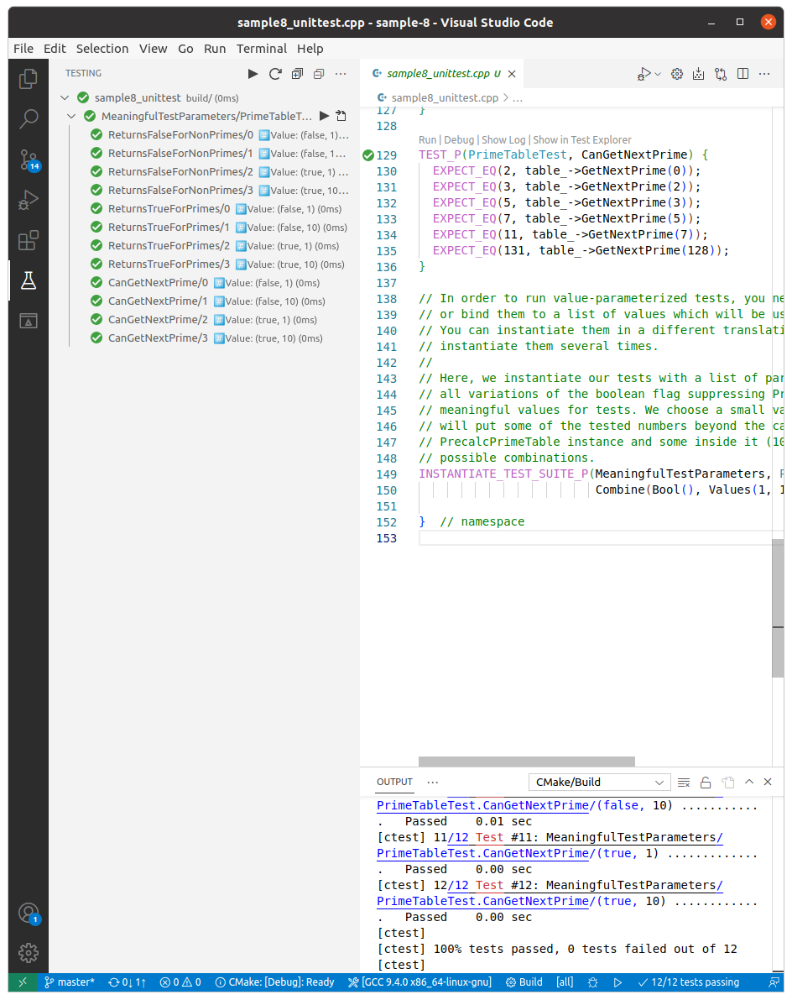

## sample 8

> Shows using `Combine()` in value-parametrized tests

This sample shows how to test code relying on some global flag variables. `Combine()` helps with generating all possible combinations of such flags, and each test is given one combination as a parameter.

Suppose we want to introduce a new, improved implementation of PrimeTable which combines speed of `PrecalcPrimeTable` and versatility of `OnTheFlyPrimeTable`. Inside it instantiates both `PrecalcPrimeTable` and `OnTheFlyPrimeTable` and uses the one that is more appropriate under the circumstances. But in low memory conditions, it can be told to instantiate without PrecalcPrimeTable instance at all and use only OnTheFlyPrimeTable.

```cpp
class HybridPrimeTable : public PrimeTable {
 public:
  HybridPrimeTable(bool force_on_the_fly, int max_precalculated)
      : on_the_fly_impl_(new OnTheFlyPrimeTable),
        precalc_impl_(force_on_the_fly
                          ? nullptr
                          : new PreCalculatedPrimeTable(max_precalculated)),
        max_precalculated_(max_precalculated) {}
  ~HybridPrimeTable() override {
    delete on_the_fly_impl_;
    delete precalc_impl_;
  }

  bool IsPrime(int n) const override {
    if (precalc_impl_ != nullptr && n < max_precalculated_)
      return precalc_impl_->IsPrime(n);
    else
      return on_the_fly_impl_->IsPrime(n);
  }

  int GetNextPrime(int p) const override {
    int next_prime = -1;
    if (precalc_impl_ != nullptr && p < max_precalculated_)
      next_prime = precalc_impl_->GetNextPrime(p);

    return next_prime != -1 ? next_prime : on_the_fly_impl_->GetNextPrime(p);
  }

 private:
  OnTheFlyPrimeTable* on_the_fly_impl_;
  PreCalculatedPrimeTable* precalc_impl_;
  int max_precalculated_;
};
```

```cpp
using ::testing::Bool;
using ::testing::Combine;
using ::testing::TestWithParam;
using ::testing::Values;
```

To test all code paths for HybridPrimeTable we must test it with numbers both within and outside PreCalculatedPrimeTable's capacity and also with `PreCalculatedPrimeTable` disabled. We do this by defining fixture which will accept different combinations of parameters for instantiating a `HybridPrimeTable` instace.

```cpp
class PrimeTableTest : public TestWithParam< ::std::tuple<bool, int> > {
 protected:
  void SetUp() override {
    bool force_on_the_fly;
    int max_precalculated;
    std::tie(force_on_the_fly, max_precalculated) = GetParam();
    table_ = new HybridPrimeTable(force_on_the_fly, max_precalculated);
  }
  void TearDown() override {
    delete table_;
    table_ = nullptr;
  }
  HybridPrimeTable* table_;
};
```

```cpp
TEST_P(PrimeTableTest, ReturnsFalseForNonPrimes) {
  // Inside the test body, you can refer to the test parameter by GetParam().
  // In this case, the test parameter is a PrimeTable interface pointer which
  // we can use directly.
  // Please note that you can also save it in the fixture's SetUp() method
  // or constructor and use saved copy in the tests.

  EXPECT_FALSE(table_->IsPrime(-5));
  EXPECT_FALSE(table_->IsPrime(0));
  EXPECT_FALSE(table_->IsPrime(1));
  EXPECT_FALSE(table_->IsPrime(4));
  EXPECT_FALSE(table_->IsPrime(6));
  EXPECT_FALSE(table_->IsPrime(100));
}
```

In order to run value-parametrized tests, you need to instantiate them, or bind them to a list of values which will be used as test parameters. 

Here, we instantiate our tests with a list of parameters. We must combine all variations of the boolean flag suppressing `PrecalcPrimeTable` and some meaningful values for tests. We choose a small value (1), and a value that will put some of the tested numbers beyond the capability of the PrecalcPrimeTable instance and some inside it (10). Combine will produce all possible combinations.

```cpp
INSTANTIATE_TEST_SUITE_P(MeaningfulTestParameters, PrimeTableTest,
                         Combine(Bool(), Values(1, 10)));
```

