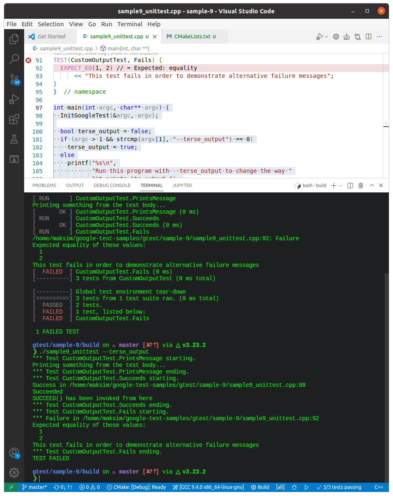

## sample 9

> Shows use of listener API to modify Google Test's console output and the use of its reflection API to inspect test results

This sample shows how to use Google Test listener API to implement an alternative console output and how to use the UnitTest reflection API to enumerate test suites and tests and to inspect their results.

```cpp
using ::testing::EmptyTestEventListener;
using ::testing::InitGoogleTest;
using ::testing::Test;
using ::testing::TestEventListeners;
using ::testing::TestInfo;
using ::testing::TestPartResult;
using ::testing::TestSuite;
using ::testing::UnitTest;
```

Provides alternative output mode which produces minimal amount of information about tests:

```cpp
class TersePrinter : public EmptyTestEventListener {
 private:
  // Called before any test activity starts.
  void OnTestProgramStart(const UnitTest& /* unit_test */) override {}

  // Called after all test activities have ended.
  void OnTestProgramEnd(const UnitTest& unit_test) override {
    fprintf(stdout, "TEST %s\n", unit_test.Passed() ? "PASSED" : "FAILED");
    fflush(stdout);
  }

  // Called before a test starts.
  void OnTestStart(const TestInfo& test_info) override {
    fprintf(stdout, "*** Test %s.%s starting.\n", test_info.test_suite_name(),
            test_info.name());
    fflush(stdout);
  }

  // Called after a failed assertion or a SUCCEED() invocation.
  void OnTestPartResult(const TestPartResult& test_part_result) override {
    fprintf(stdout, "%s in %s:%d\n%s\n",
            test_part_result.failed() ? "*** Failure" : "Success",
            test_part_result.file_name(), test_part_result.line_number(),
            test_part_result.summary());
    fflush(stdout);
  }

  // Called after a test ends.
  void OnTestEnd(const TestInfo& test_info) override {
    fprintf(stdout, "*** Test %s.%s ending.\n", test_info.test_suite_name(),
            test_info.name());
    fflush(stdout);
  }
};
```

```cpp
int main(int argc, char** argv) {
  InitGoogleTest(&argc, argv);

  bool terse_output = false;
  if (argc > 1 && strcmp(argv[1], "--terse_output") == 0)
    terse_output = true;
  else
    printf("%s\n",
           "Run this program with --terse_output to change the way "
           "it prints its output.");

  UnitTest& unit_test = *UnitTest::GetInstance();

  // If we are given the --terse_output command line flag, suppresses the
  // standard output and attaches own result printer.
  if (terse_output) {
    TestEventListeners& listeners = unit_test.listeners();

    // Removes the default console output listener from the list so it will
    // not receive events from Google Test and won't print any output. Since
    // this operation transfers ownership of the listener to the caller we
    // have to delete it as well.
    delete listeners.Release(listeners.default_result_printer());

    // Adds the custom output listener to the list. It will now receive
    // events from Google Test and print the alternative output. We don't
    // have to worry about deleting it since Google Test assumes ownership
    // over it after adding it to the list.
    listeners.Append(new TersePrinter);
  }
  int ret_val = RUN_ALL_TESTS();

  // This is an example of using the UnitTest reflection API to inspect test
  // results. Here we discount failures from the tests we expected to fail.
  int unexpectedly_failed_tests = 0;
  for (int i = 0; i < unit_test.total_test_suite_count(); ++i) {
    const testing::TestSuite& test_suite = *unit_test.GetTestSuite(i);
    for (int j = 0; j < test_suite.total_test_count(); ++j) {
      const TestInfo& test_info = *test_suite.GetTestInfo(j);
      // Counts failed tests that were not meant to fail (those without
      // 'Fails' in the name).
      if (test_info.result()->Failed() &&
          strcmp(test_info.name(), "Fails") != 0) {
        unexpectedly_failed_tests++;
      }
    }
  }

  // Test that were meant to fail should not affect the test program outcome.
  if (unexpectedly_failed_tests == 0) ret_val = 0;

  return ret_val;
}
```

Now we can use the `--terse_output` option to configure the look of the output:

