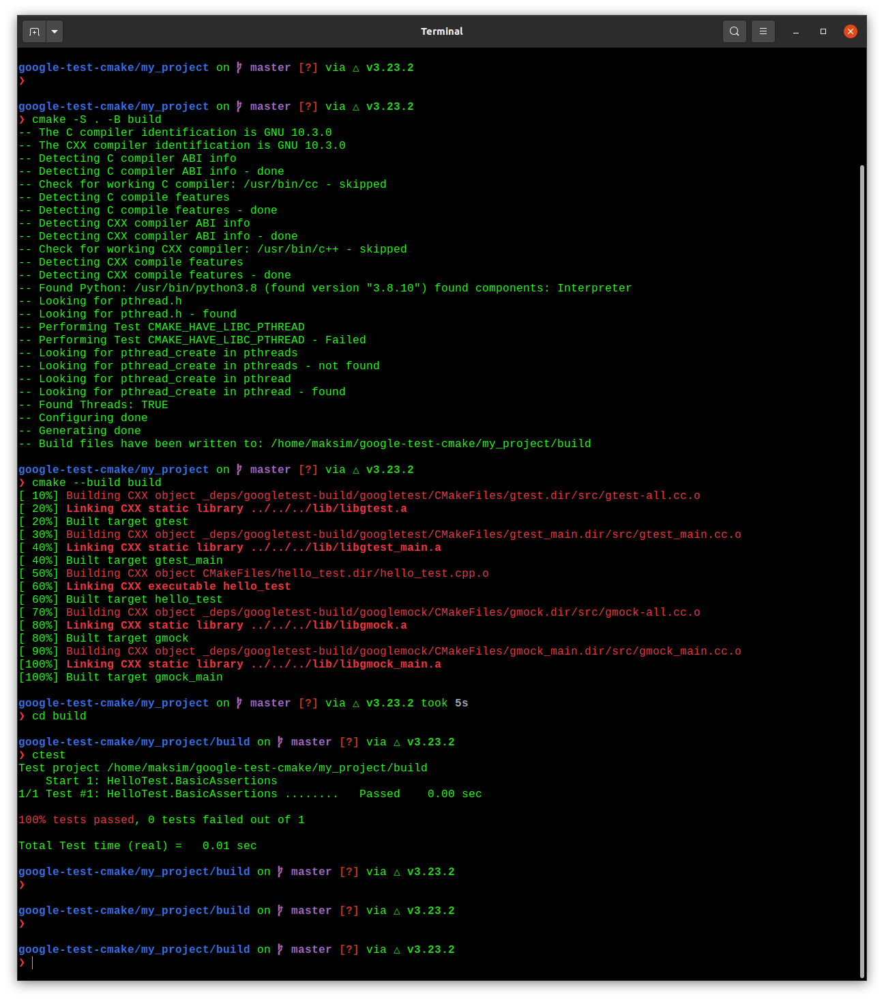
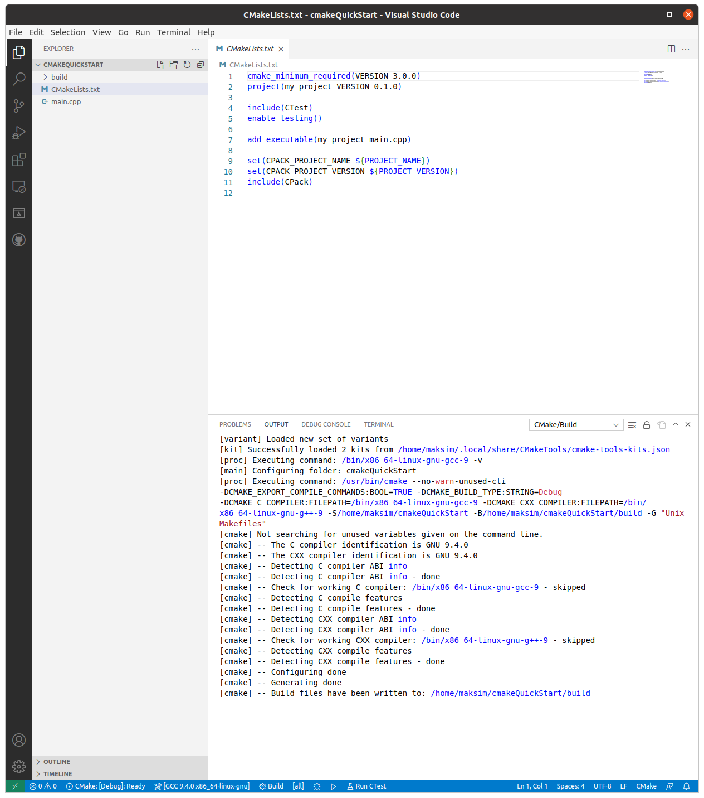
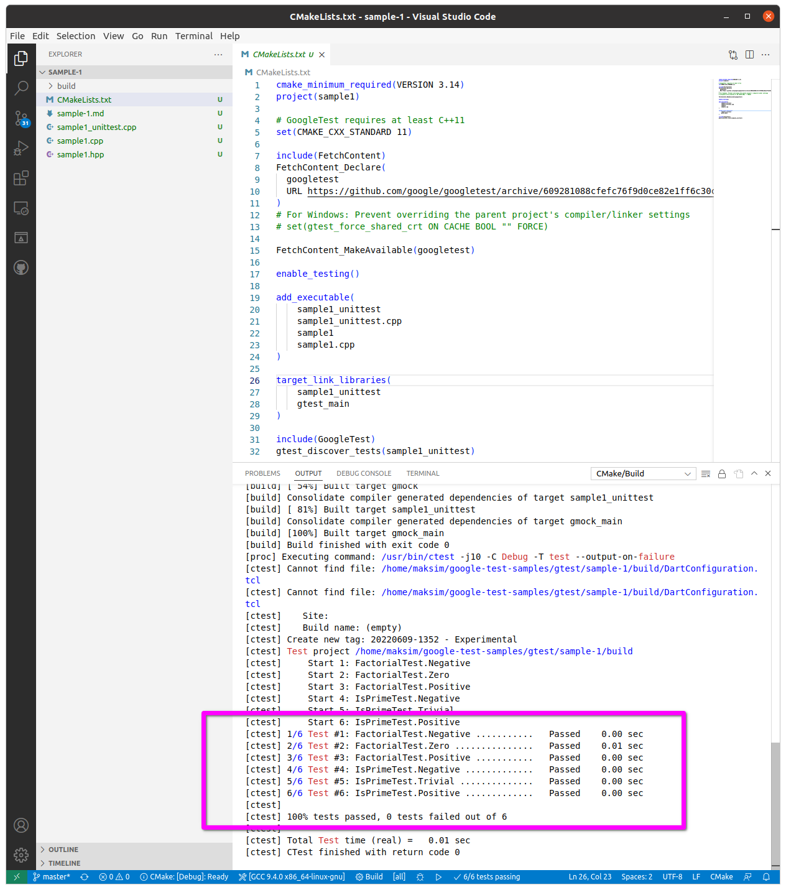

# Setup

## Basics

### Prerequisites

- Linux
- C++ compiler
- CMake

To check:

```
gcc --version
cmake --version
```

### Set up a project

CMake uses a file name `CMakeLists.txt` to configure the build system for a project. You'll use this file to set up your project and declare a dependency on GoogleTest.

First create a directory for your project.

```
mkdir my_project
cd my_project
```

Next, you'll create the `CMakeLists.txt` file and declare a dependency on GoogleTest. There are many ways to express dependencies in the CMake ecosystem; here, we'll use the `FetchContent` Cmake module. To do this, in your project directory, create a file named `CMakeLists.txt` with the following contents:

```cmake
cmake_minimum_required(VERSION 3.14)
project(my_project)

# GoogleTest requires at least C++11
set(CMAKE_CXX_STANDARD 11)

include(FetchContent)
FetchContent_Declare(
    googletest
    url https://github.com/google/googletest/archive/609281088cfefc76f9d0ce82e1ff6c30cc3591e5.zip
)
```

For more information about how to create `CMakeLists.txt` files, see the [CMake tutorial](https://cmake.org/cmake/help/latest/guide/tutorial/index.html)

### Create and run a binary

With GoogleTest declared as a dependency, you can use GoogleTest code within your project.

As an example, create a file named `hello_test.cpp` in your project directory with the following contents:

```cpp
#include <gtest/gtest.h>

// Demonstrate some basic assertions.
TEST(HelloTest, BasicAssertions) {
  // Expect two strings not to be equal.
  EXPECT_STRNE("hello", "world");
  // Expect equality.
  EXPECT_EQ(7 * 6, 42);
}
```

GoogleTest provides assertions that you can use to test the behaviour of your code. The above example includes the main GoogleTest header file and demonstrates some basic [assertions](https://google.github.io/googletest/reference/assertions.html). 

To build the code, add the following to the end of your `CMakeLists.txt` file:

```cmake
enable_testing()

add_executable(
  hello_test
  hello_test.cc
)
target_link_libraries(
  hello_test
  gtest_main
)

include(GoogleTest)
gtest_discover_tests(hello_test)
```

The above configuration enables testing in CMake, declares the C++ test binary you want to build (`hello_test`), and links to GoogleTest (`gtest_main`). The last two lines enable CMake's test runner to discover the tests included in the binary, using the GoogleTest CMake module.

Now you can build and run your test:

```
cmake -S . -B build
cmake --build build
cd build
ctest
```

The end result:



## VSCode

### CMake Tools

The [CMake Tools](https://code.visualstudio.com/docs/cpp/CMake-linux) extension integrates VSCode and CMake to make it easy to configure, build, and debug your C++ project.

### Creating a project

Create a CMake project:

```
mkdir cmakeQuickStart
cd cmakeQuickStart
code .
```

The `code .` command opens VSCode in the current directory, which becomes your "workspace".

Open the command palette and run the `CMake: Quick Start` command.

Select a kit (use the latest version if in doubt).

Enter a project name (`my_project`), this will be written to `CMakeLists.txt` and a few initial source files. 

Next, select `Executable` as the project type to create a basic source file (`main.cpp`) that includes a basic `main()` function.

Note: if you had wanted to create a basic source and header file, you would have selected `Library` instead.



### Build

Open the command palette and run the `Cmake: Build` command, or select the `Build` button from the status bar.

### Debug

Put a breakpoint on a line, then open the command palette and run `Cmake: Debug`, or select the `Debug` button from the status bar.

### Run tests

Open the command palette and run the `CMake: Run Tests` command, or select the `Test` button from the status bar. (There are no in the project we have setup so you'll see `0/0 tests passing` in the status bar)

Note: result of the tests can also be observer by clicking on the "Testing" sidebar option.

You can also run the tests manually (after building):

```
cd build
ctest
```

### Importing a project

To test importing a project, clone the [google-test-samples](https://github.com/maksimdrachov/google-test-samples) repository.

```
git clone https://github.com/maksimdrachov/google-test-samples
cd ~/google-test-samples/gtest/sample-1
code .
```

Open the command palette and run `CMake: Quick Start` (or it should run automatically).

Now you can build, debug and run tests as discussed in the previous section.

Note: if build doesn't work due to the presence of an older `build` folder, delete the `build` folder and try again.

For example, now we have some actual tests we can run:

